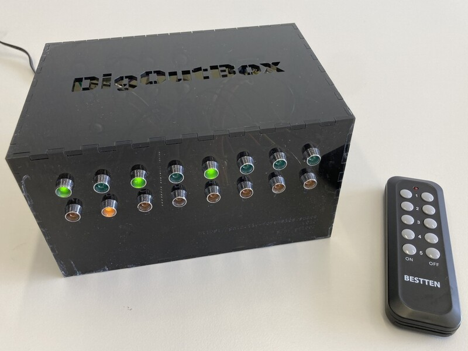

# DigOutBox

This project provides instrument builders with an easy interface
to control digital output pins to control other devices,
e.g., laser shutters.
The project makes use of an
[Arduino Mega](https://store.arduino.cc/products/arduino-mega-2560-rev3)
in order to have digital output pins available via
DSub-9 and BNC connectors.
Each channel will have its own LED as an indication status
if the channel is high (LED on) or low (LED off).
The Arduino can be controlled via a serial using a standard set of
[SCPI commands](https://en.wikipedia.org/wiki/Standard_Commands_for_Programmable_Instruments)
in order to control the device.
Furthermore,
a Python communications class
and a Python GUI (making use of this class)
are provided for easy control of the DigOutBox.
Finally,
the Arduino can also take commands from an RF control at 433 MHz,
which puts it in the allowable range in the US and in Europe,
to drive digital outputs.
The idea of the remote is to give the user direct control
when attending to, e.g., a laser on the table.
Depending on the number of channels the control has
(the default is 8),
multiple channels can be controlled.

| [ Front and top of DigOutBox</img>](docs/img/boxes/gfl002_setup.jpeg) | [ Back of DigOutBox</img>](docs/img/boxes/gfl002_back_top.jpeg) |
|:--------------------------------------------------------------------------------------------------------------------------------------:|:--------------------------------------------------------------------------------------------------------------------------------:|

## Folders and further information

This git repository contains the following folders that might be useful to the user:

- `controller`: Python interface to control the box from a computer.
- `controller_gui`: Python graphical user interface to control the box from a computer.
- `firmware`: Arduino firmware.
- `hardware`: Designs with bill of materials, build instructions, etc.
- `images`: Images of the box.

Please also see the full documentation
[here](https://digoutbox.readthedocs.io/).

## Issues

If you encounter any issues, please raise an issue in this repository.

## Contribution

If you would like to contribute,
please get in touch with us.
If you have a specific issue with the software you would like to discuss,
please feel free to raise an issue and mention
that you would like to contribute.

## Acknowledgement

- [rc-switch](https://github.com/sui77/rc-switch) (LGPL 2.1): Library used to read in remote 433 MHz RF signals to add a remote control to the DigIOBox.
- [Vreker SCPI Parser](https://github.com/Vrekrer/Vrekrer_scpi_parser) (MIT):
  Used to create the SCPI interface on the Arduino.
- [InstrumentKit](https://github.com/Galvant/InstrumentKit) (AGPL-v3):
  Several parts of the python driver (code and conceptual idea)
  were adopted from this fanastic driver suite.

## License

This project is licensed under [MIT](LICENSE).
Copyright: 2021-2024, Reto Trappitsch
