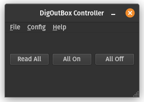
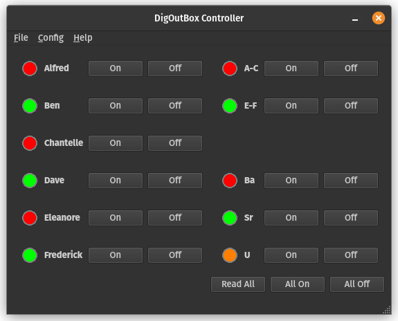
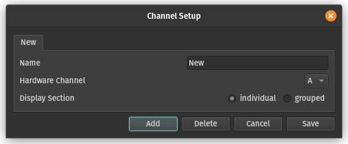
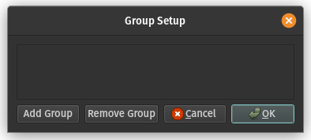
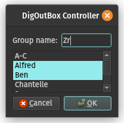
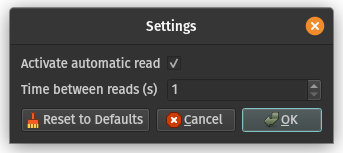

# Graphical User Interface (GUI)

The GUI allows you to control the DigOutBox from a computer
via a graphical user interface.

It is recommended that you install one of our official releases,
if available for your system.
You can find the latest releases
[on GitHub](https://github.com/galactic-forensics/DigOutBox/releases).

## Requirements for running from source

You need to have either `PyQt6` or `PySide6` installed.
Further requirements are listed in `src/requirements/base.txt`.

!!! note
    If you want to compile the GUI to a standalone executable,
    you must have `fbs-pro` installed,
    see [here](https://build-system.fman.io/).

### Arduino on Windows

If you are using Windows,
you can install the Arduino drivers manually.
A useful help article can be found
[here](https://www.candelatech.com/cookbook.php?vol=misc&book=Install+Arduino+Mega+Driver+on+Windows+10)

Alternatively,
you could install the Arduino IDE from
[here](https://www.arduino.cc/en/software).
Unplug and replug the Arduino after installation.

If it still does not work,
open the device manager,
and look for the COM port of the Arduino.
The properties of the device, in extras,
will mention that the device needs further installation.
Update the driver by searching the local computer for drivers
where you installed the Arduino IDE.
This path is most likely:
```
C:\Users\<USERNAME>\AppData\Local\Arduino15\packages\arduino\hardware\avr\1.8.3\drivers
```


## Usage

The simplest way to use the GUI is to download an installer
from our [releases](https://github.com/galactic-forensics/DigOutBox/releases).
We provide installers for Windows.
This is especially recommended for air-gapped systems,
since no internet connection is required.
Install the program as you would any other windows program.

You can also run the program directly from source.
To do so, first install the requirements.
Then run the following command from the `src/main/python` directory:

```bash
python -m main.py
```

!!! tip
    If you want to check out the program without any hardware,
    hit "Cancel" when asked to select a COM port.
    This will start the program in demo mode,
    where no hardware interaction takes place
    and some "dummy" values are returned from the controller.

## Controller configuration and settings files

The settings and configuration files are by default saved to the following locations:

- Windows: `%APPDATA%\Roaming\DigOutBox`
- Linux/macOS: `$HOME/.config/DigOutBox`

If you encounter issues with the software,
it might be worth deleting these files and restarting the program.

!!! warning
    If you delete these files,
    you will lose your configuration and settings.

The following settings files are used:

- `config.json`: User setup of channels and groups.
- `settings.json`: GUI settings, as modified by the user in the settings dialog.
- `hw_config.json`: The hardware configuration file.

### Hardware configuration

When first started,
the hardware configuration file is written
using the currently hardcoded initial configuration file.
The hardcoded list of channels is valid for the first boxes,
i.e., `llnl001` and `gfl002`.
In here is a list of all available channels in order.
This means,
the first line is the label for the first channel,
the second line the label for the second channel, etc.
The number of lines in this file must match the number of channels in the hardware.
Note that the first lines corresponds to channel 0 in the CLI controller.

If you have a modified box,
change this file after it is initially created to match your hardware.
This file will only be written if it does not exist already.

## First startup

On the first startup,
the standard hardware configuration file (if not existent)
and settings file are written.
The settings file is written with the default settings.
No channels are configured.
Before you get to the main UI,
you have to select your DigOutBox from the list of available devices,
i.e., you have to select the correct COM port.
If you select the wrong COM port,
the program will notice and give you the list of available COM ports again.
The COM port will be saved in the settings for the next time you start the program.

If you don't want to set a COM port and hit "Cancel",
the program starts in demo mode.
No hardware interaction will take place.

Once you are in the main program,
your screen should look like this:



The channel list is empty.
On top is the menu bar.
The center widget contains three buttons that don't do anything at this point,
since no channels are configured.
At the bottom is the statusbar,
which will display messages and menubar tooltips.

!!! tip
    All buttons and menubar entries have tool tips implemented.
    Hover over them to get more information.

Once your channels are configured,
the user interface might look something like this:



The left column contains the list of channels that were configured as "individual" (see below).
These are meant to be individual channels that control one device,
e.g., a shutter controlling a laser.
The top of the right column contains channels that were configured as "grouped".
These are meant to be individual channels that control multiple devices,
e.g., a shutter for a combined beam line.
In the bottom of the right column are groups of channels displayed.
These are software defined groups of channels (see below).

Each channel has a status indicator, a label, as well as "On" and "Off" buttons.
The status indicator has four states:

- Green: The channel is on.
- Red: The channel is off.
- Orange: Some channels in the software group are on, some are off.
  This status only applies to software groups
- Gray: The channel state is unknown.

## Configuration of channels

To configure your own channels,
click "Config" -> "Channels" in the menubar.
You will be presented with a window like this:



Here you have a tabbed widget where the tab names equal the channel names.
Modify the channel name,
select the correct hardware channel,
and select which display section "individual" or "grouped" this channel should be in.
You can add more channels by clicking "Add" and
delete a channel by clicking "Delete".
Pressing cancel will discard all changes.
"Save" checks if the configuration is valid and saves it.

!!! note
    Channel names have to be unique,
    furthermore you can only select a given hardware channel once.

## Configuration of software groups

To configure a software group,
i.e., an entry in the main UI that controls multiple channels,
you have to click "Config" -> "Groups" in the menubar.
You will be presented with a window like this:



If groups were already defined,
a list of groups will be shown.
You can remove individual groups with the respective button.

To add a new group,
click "Add Group".
This will present you with a window as following:



Now type in a name for the group,
and select which channels should be part of the group.
Then click "Ok".

Once all groups are configured,
click "Ok" in the "Group Setup" window.
Your software defined groups will now show up in the main UI.

## Settings

To configure the settings of the GUI,
click "Config" -> "Settings" in the menubar.
You will be presented with a window like this:



Here you can configure if you want the status of channels to be automatically read
(if so, set the checkbox as in the picture)
and how frequently (in seconds) this should be done.
When you are done, hit "Ok" to save the settings.

## Lockouts

The GUI does not behave differently depending on which lockout is active.

### Interlock safety

If enabled in the firmware,
the interlock safety - if triggered -
will disable sending commands to the hardware from any input method.
The GUI will change its behavior to reflect this and,
after reading the hardware,
gray out all interaction buttons.

If the interlock safety is triggered,
all channels will turned off and stay off.
Neither the software,
nor the remote can overwrite this.

### Software lockout

The remote can be configured to have a software lockout button,
see firmware notes.
If enabled,
the GUI will change its behavior to reflect this and,
after reading the hardware,
gray out all interaction buttons.

If the software lockout is triggered,
the software will not be allowed to change the state of any channel.
However, the remote can still change the state of the channels.


## Saving your configuration file / loading a configuration file

The "File" entry in the menu bar allows you to save the current configuration
either to the default location (select "Save")
or to a user specific location (select "Save As").

Loading a configuration file is done by clicking "Load",
then selecting the configuration file.
Note that this will overwrite the current configuration.
