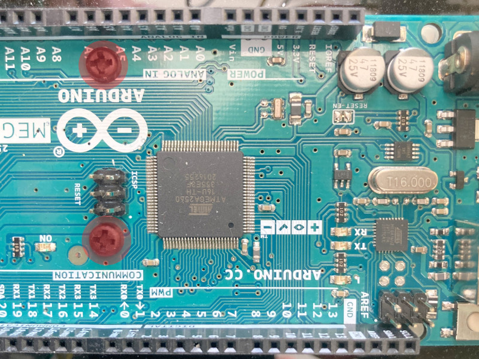
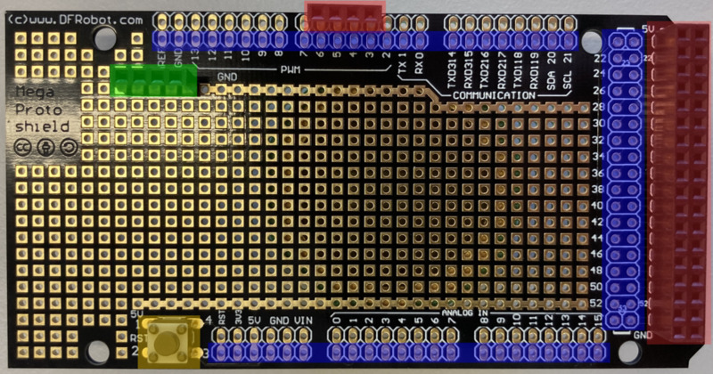
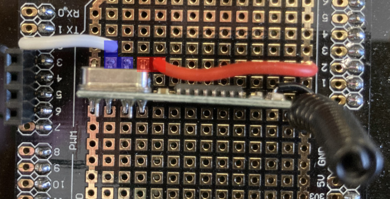
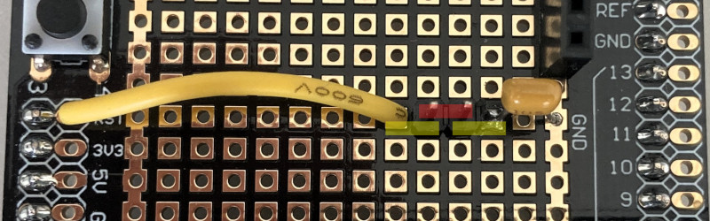
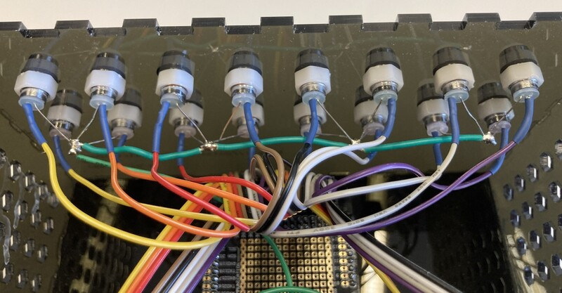
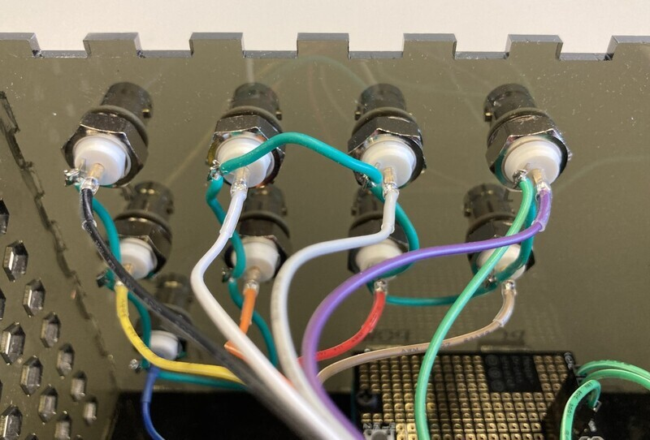
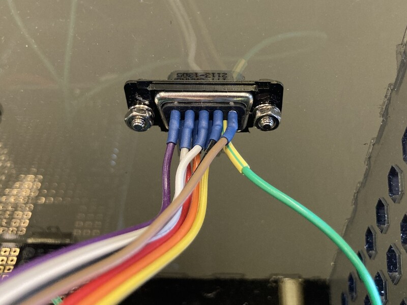
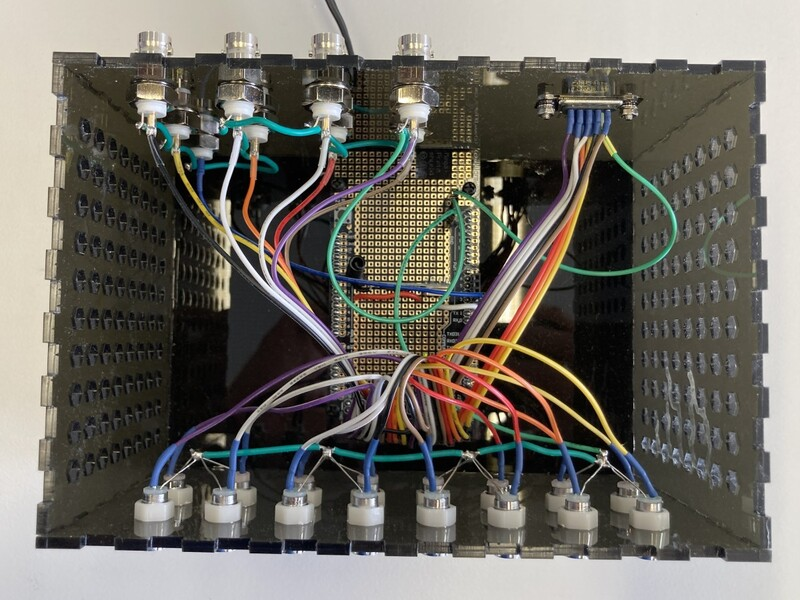

# Hardware

The following sections describe how to assemble the DigOutBox.
It is recommended that you read the whole page before starting,
especially since some tips are given towards the end
that will make the building process easier.

## Hardware requirements

Here are general hardware requirements.

Required:

- Soldering iron, solder, supplies
- Laser cutter and acrylic sheets
- M3 tap
- Wrenches / Screwdrivers to mount DB-9 and BNC connectors

Nice to have:

- Hookup wire
- Shrink tube

## Bill of materials

The following table lists the parts that are needed to assemble the DigOutBox.
Note that this assembly for a box that has 8 outputs via a DB-9 connector
and 8 outputs via BNC connectors.
Furthermore, the box has 16 LEDs to indicate the status of each output.
A trigger/interlock input is also provided via a BNC connector,
however, it is not used in the current version of the firmware.

| Part                   | Quantity | Description                  | Link                                                                                                 |
|------------------------|----------|------------------------------|------------------------------------------------------------------------------------------------------|
| Arduino Mega 2560 Rev3 | 1        | Arduino Mega 2560 Rev3       | [Link](https://store.arduino.cc/products/arduino-mega-2560-rev3)                                     |
 | 12V power supply       | 1        | 12V power supply             | [Link](https://www.digikey.com/en/products/detail/tensility-international-corp/16-00216/13235972)    |
 | USB cable              | 1        | USB male A - male B          | [Link](https://www.digikey.com/en/products/detail/micro-connectors-inc/E07-121BLB/16353389)          |
| Mega Proto Shield      | 1        | Shield for Arduino Mega      | [Link](https://www.digikey.com/en/products/detail/dfrobot/DFR0016/7087126)                           |
| 433 MHz RF receiver    | 1        | 433 MHz RF receiver          | [Link](https://www.digikey.com/en/products/detail/rf-solutions/QAM-RX10-433/6235156)                 |
| Capacitor              | 1        | 1 - 10 µF                    | [Link](https://www.digikey.com/en/products/detail/kyocera-avx/M39014-02-1415V/3451965)               |
 | Remote control         | 1-2      | Bestten 433.92 MHz (see tip) | [Link](https://ibestten.com/collections/remote-control-outlets)                                      |
| DB-9 connector         | 1        | DB-9 connector               | [Link](https://www.digikey.com/en/products/detail/mh-connectors/MHDB9SS/16983851)                    |
 | DB-9 hardware          | 1        | D-Sub Hardware Set           | [Link](https://www.digikey.com/en/products/detail/adam-tech/HDW-023/9831277)                         |
| BNC connector          | 9        | BNC connector                | [Link](https://www.digikey.com/en/products/detail/adam-tech/rf1-08-d-00-50-hdw/9830966)              |
 | LED green              | 8        | LED green                    | [Link](https://www.digikey.com/en/products/detail/broadcom-limited/HLMP-3680/637607)                 |
| LED orange             | 8        | LED orange                   | [Link](https://www.digikey.com/en/products/detail/broadcom-limited/HLMP-3650/637605)                 |
 | LED mounts             | 16       | LED panel mounts             | [Link](https://www.digikey.com/en/products/detail/sparkfun-electronics/COM-11147/5673798)            |
 | Standoffs              | 6        | M3, 6mm, Nylon               | [Link](https://www.digikey.com/en/products/detail/essentra-components/36M30MF006/11635648)           |
 | Screws                 | 6        | M3, XXmm                     | [Link](https://www.digikey.com/en/products/detail/essentra-components/50M030050I020/11638554)        |
 | Male-Male Wire         | 1        | Pack of wires                | [Link](https://www.digikey.com/en/products/detail/canaduino/120-DuPont-Breadboard-Wires/15760543)    |
 | Male-Female Header     | 2        | Pieces                       | [Link](https://www.digikey.com/en/products/detail/sullins-connector-solutions/PPPC041LFBN-RC/810176) |

!!! note
    - Screws and standoffs are examples, any other screws / standoffs will work as well, however, ensure that the standoff is 6 mm!
    - Male-male wires are recommendations, since they make the wire management easier.
    - Headers are recommended for creating pluggable connections. Solder solutions will work as well.
    - Select the USB cable according to your length requirements.
    - Ensure that the power supply works in your country.

!!! tip
    It used to be possible to buy the Bestten remote controls individually.
    This seems not to be the case anymore,
    therefore the link above points to the remote controlled outlets.
    However, you can use other remotes as well,
    as long as they are compatible with the `rc-switch` Arduino library.
    A nice compilation of compatible remotes can be found
    [here](https://github.com/sui77/rc-switch/wiki/List_KnownDevices).

## Assembly instructions

### Case

The case can be cut out of acrylic sheets using a laser cutter.
The folder `case`
on [GitHub](https://github.com/galactic-forensics/DigOutBox/tree/main/hardware)
contains the files for the case.
The `svg` file has been created using [Inkscape](https://inkscape.org/)
and contains various layers that can be turned on and off.
In order for all fonts to properly display,
ensure that you have the font [`Black Ops One`](https://www.fontsquirrel.com/fonts/black-ops-one)
installed on your system.
Layers in the `svg` file have the following meaning:

- `cutout_layer`: This layer contains cutouts for connectors, etc.
- `box_layer`: This layer contains the box outline (needs to be cut out as well).
- `etching_layer`: This layer contains text that can be etched into the case.
- `remarks`: This layer contains remarks that are not relevant for the laser cutter but help the user.
- `outline`: This layer contains the outline of the overall file and can be useful for aligning the etch and cut layers.

There are also two `pdf` files provided:

- `digout_box_laser_cutting_cut_layer.pdf`: Cut file for cutting the case and holes out of the acrylic sheet.
- `digout_box_laser_cutting_etch_layer.pdf`: Etch file for etching descriptions on the case.

Depending on your laser settings,
the case might not hold together by itself.
In this case, we recommend to use a hot glue gun to glue the bottom and sides together
after the components have been installed and tested!
During testing,
hold the case together using masking tape or similar.

### Assembly of the case

1. Run the M3 tap through the holes in the bottom of the case.
2. Screw the standoffs into the holes on the bottom.
   If the standoffs are too long, you can cut them down to the desired length.
3. Screw the Arduino with two short mounting screws to the standoffs (see picture below).

      

4. Mount the DB-9 connector to the case and tighten it.
5. Mount the BNC connectors to the case and tighten them.
6. Mount the LED holders to the case and tighten them.
7. Add the LEDs to the LED holders.

### Assembly of the electronics

1. Solder the headers, which connect the proto shield to the Arduino, to the bottom proto shield (blue markings).
2. Solder the reset button onto the proto shield (if you want to use the reset button) (yellow marking).
3. Solder additional headers to the proto shield, see green (ground headers) and red markings (pin headers) in picture below.

      

4. Solder the RF receiver to the proto shield. Anywhere on the proto shield is fine.

    5. Connect the `Vcc` pin of the RF receiver to the `5V` line on the proto shield.
    6. Connect the ground pin of the RF receiver to the ground line on the proto shield.
    7. Connect the `Data` pin of the RF receiver to pin `2` on the proto shield: This is interrupt 0.

    

    !!! note
        The blue (data) and red (5V) boxes show connections made on the bottom of the proto shield.
        The ground connection (leftmost) is directly connected to the ground line on the proto shield.

5. Solder the capacitor and a jumper wire between the reset pin and ground.

    

    !!! note
        The yellow markings show connections that are done underneath. The red marking show the jumper position.
        When flashing firmware to the Arduino, this connection must be opened, when running the box, this connection should be closed.

6. Solder all the  LED cathodes together and add a wire that can plug into the proto shield (see image below).
7. Solder all the grounds of the BNC connectors together and add a wire that can plug into the proto shield (see image below).
8. Solder DB-9 pin 9 to the ground line on the proto shield (see image below).
9. Solder the anodes of the LED's each to its individual line that can be plugged into the proto shield.

    

10. Solder each BNC plug to its individual line that can be plugged into the proto shield.

    

11. Solder pins 1 through 8 of the DB-9 connector to the individual lines that can be plugged into the proto shield.

    

Now you are ready to connect all your components to the proto shield and assemble the box.
Plug in all the grounds to the ground lines.
Plug in all LEDs, BNC connectors, and DB-9 connector to their respective lines.
For the current existing setups,
pin assignments can be found in the
[`firmware/configs`](https://github.com/galactic-forensics/DigOutBox/tree/main/firmware/configs)
folder.
Here, `xlsx` files provide pin outs for various serial number numbers.
Each file goes with its respective `.h` file, which contains the configuration for the firmware
(discussed below).

Your finished box should look inside something like this
(however, in this image the reset pin to ground connection via a capacitor was still missing).

!!! tip
    If you bought the male-male wires from the recommended link,
    or bought similar wires, DO NOT take them apart.
    Study first the LED setup and connections,
    such that you can leave the wires stuck to each other.
    This makes plugging them into the proto shield much easier.
    The same is the case for the wires of the BNC and DB-9 connectors,
    see also the photo of our overall assemblies [here](images.md).

Once everything is plugged in, move on to the section on [firmware](firmware.md).

## Jumper settings

The jumper serves to connect the reset pin of the Arduino via a capacitor to ground.
Firmware can only be flashed when this connection is open (jumper removed).
However, if you want to control your DigOutBox from the computer with the provided software,
you should close this jumper (jumper inserted).
Otherwise, the Arduino will restart whenever you (re-)establish the serial connection.
This means that all digital outputs will go to their off state and all LEDs will turn off.
