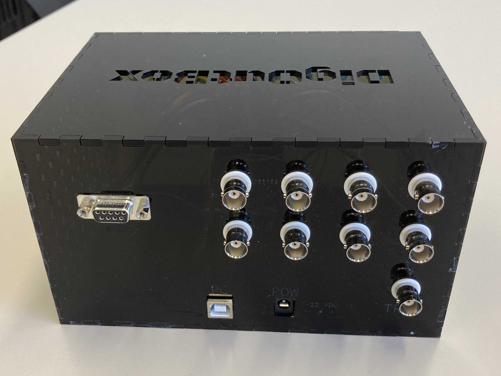

# DigOutBox Documentation

## Welcome!
This project provides instrument builders with an easy interface
to control digital output pins to control other devices,
e.g., laser shutters.
The project makes use of an
[Arduino Mega](https://store.arduino.cc/products/arduino-mega-2560-rev3)
in order to have digital output pins available via
DSub-9 and BNC connectors.
Each channel will have its own LED as an indication status
if the channel is high (LED on) or low (LED off).
The Arduino can be controlled via a serial using a standard set of
[SCPI commands](https://en.wikipedia.org/wiki/Standard_Commands_for_Programmable_Instruments)
in order to control the device.
Furthermore,
a Python communications class
and a Python GUI (making use of this class)
are provided for easy control of the DigOutBox.
Finally,
the Arduino can also take commands from an RF control at 433 MHz,
which puts it in the allowable range in the US and in Europe,
to drive digital outputs.
The idea of the remote is to give the user direct control
when attending to, e.g., a laser on the table.
Depending on the number of channels the control has
(the default is 8),
multiple channels can be controlled.

## Some images

More images can be found [here](images.md).

|  |  |
|:----------------------------------------------------------------------------------------:|:----------------------------------------------------------------------------------------:|
|                           Front of the box and remote control                            |                             Back of the box with connections                             |

## Source code, issues, contributions

All source code is available on
[GitHub](https://github.com/galactic-forensics/DigOutBox).
If you encounter any problems,
would like to contribute,
have feature requests,
please get in contact by filing an
[issue on GitHub](https://github.com/galactic-forensics/DigOutBox/issues).
